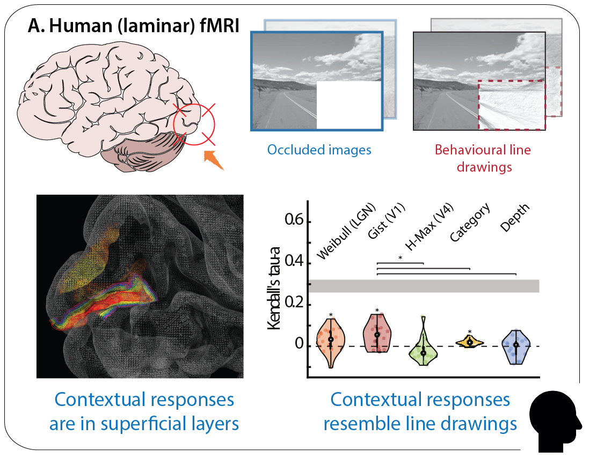
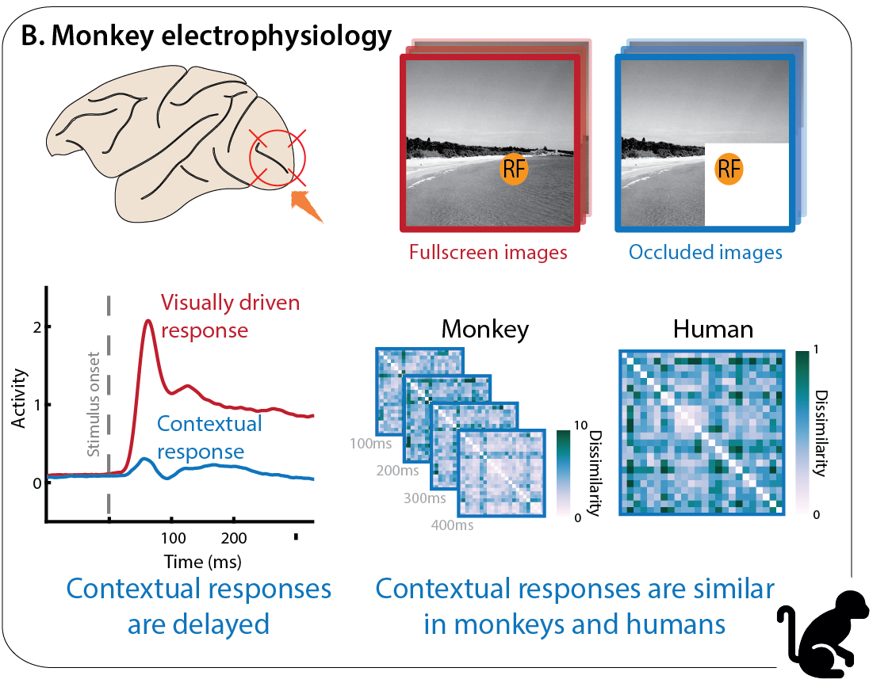
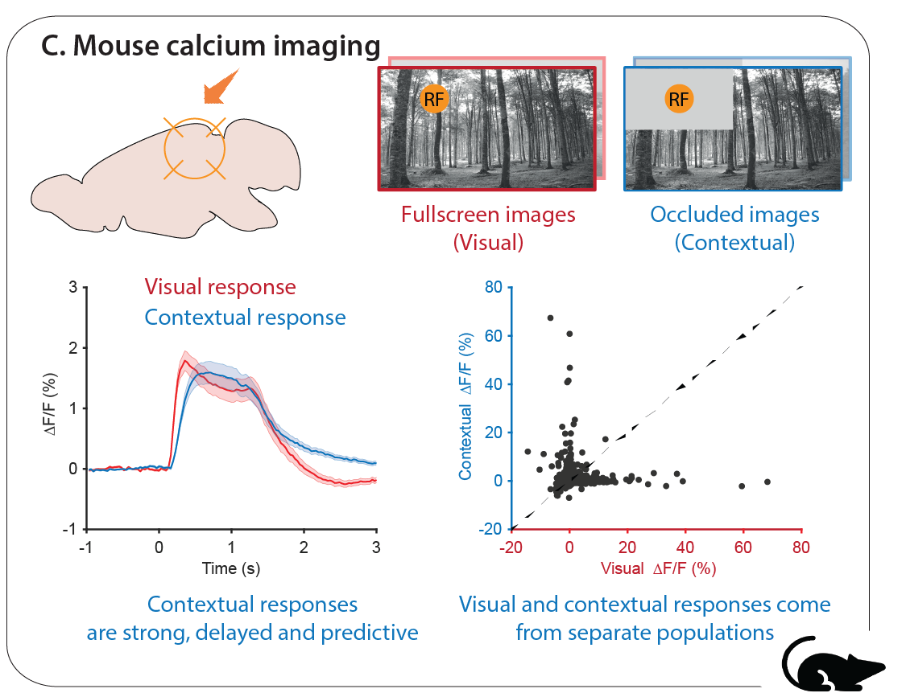
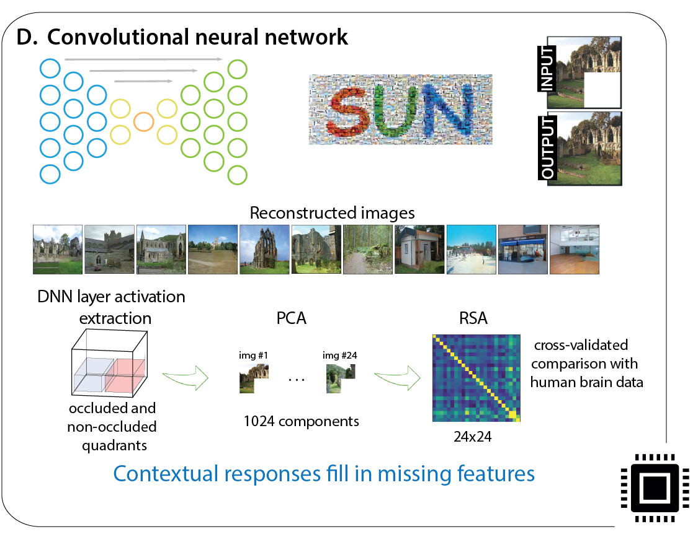

# The cortical microcircuitry of predictions and context - a multi-scale perspective

## Abstract

Conscious cognition depends on the ability of the neocortex to generate internal models of the outside world. During wakefulness, the neocortex maintains and updates knowledge of the world and uses this knowledge through top-down projections to make predictions, test hypotheses, and/or contextualise input from the senses. How are these information streams combined in cortical microcircuits? Is their computational function to test internal models on the basis of their predictions or to contextualise sensory signals, or both? In addition to their somatic integration zones, many pyramidal neurons have a site of top-down and other contextual  information integration near the top of the apical dendrite’s trunk. This architecture enables top-down contextualisation of bottom-up information, amplifying or attenuating sensory responses depending on prior knowledge and current context. However, current deep neural network models of sensory processing lack such a mechanism, and cognitive theories do not reach the explanatory level of intracellular two-compartment integration. In this interactive "live" paper, we envision how a continued synthesis of multi-scale, multi-species experimental data and theoretical and data-driven models will drive further insights into the biophysics, microcircuitry and dynamics of context-sensitive two-compartment neurons, and their role in predictive cognition. 

*To access the Jupyter notebook, simply click on any of the four quadrants below.*

  
  
  
  

## Authors

Lars Muckli1,2,\*,
Lucy S. Petro1,2,\*, 
Clement Abbatecola1,2, 
Ahsan Adeel3,4, 
Johanna Bergmann5, 
Nicolas Deperrois6,7, 
Alain Destexhe8, 
Nikolaus Kriegeskorte9, 
Christiaan N. Levelt10,11, 
Wolfgang Maass12, 
A. Tyler Morgan13, 
Paolo Papale14, 
Cyriel M. A. Pennartz14,15, 
Benjamin Peters1, 
Mihai A. Petrovici6,7, 
William. A. Phillips16, 
Pieter R. Roelfsema17,18,19,20, 
Robert N.S. Sachdev21, 
Koen Seignette10, 
Matthew W. Self17, 
Fraser W. Smith22, 
Johan F. Storm23, 
Michele Svanera1,2, 
Wim Vanduffel24,25,26,27, 
Walter Senn6,7\*, 
Matthew E. Larkum21,28\* 

1. Centre for Cognitive Neuroimaging, School of Psychology and Neuroscience, College of Medical, Veterinary and Life Sciences, University of Glasgow, Glasgow, G12 8QB, UK
2. Imaging Centre for Excellence, Queen Elizabeth University Hospital, University of Glasgow, G51 4LB, UK
3. CMI Lab, Department of Computing Science and Mathematics, University of Stirling, FK9 4LA, Stirling, UK
4. Oxford Computational Neuroscience Lab, Nuffield Department of Surgical Sciences, University of Oxford, Oxford, UK.
5. Max Planck Institute for Human Cognitive and Brain Sciences, Leipzig, Germany
6. Department of Physiology, University of Bern, Switzerland
7. Kirchhoff-Institute for Physics, Heidelberg University, Germany
8. Paris-Saclay University, CNRS, Saclay, France
9. Zuckerman Mind Brain Behavior Institute, Columbia University, 3227 Broadway, New York, NY, 10027, USA
10. Netherlands Institute for Neuroscience, Molecular Visual Plasticity Group, Royal Netherlands Academy of Arts and Sciences, Meibergdreef 47, 1105 BA Amsterdam, the Netherlands
11. Department of Molecular and Cellular Neurobiology, Center for Neurogenomics and Cognitive Research, VU University Amsterdam, de Boelelaan 1085, 1081 HV Amsterdam, the Netherlands
12. Institute of Theoretical Computer Science, Graz University of Technology, Graz, Austria
13. Section on Functional Imaging Methods, National Institute of Mental Health, Bethesda, MD 20817, USA
14. Cognitive and Systems Neuroscience Group, Swammerdam Institute for Life Sciences, University of Amsterdam, Science Park 904, 1098XH Amsterdam, the Netherlands
15. Amsterdam Brain and Cognition, University of Amsterdam, Science Park 904, 1098XH Amsterdam, the Netherlands
16. Department of Psychology, University of Stirling, Stirling, FK9 4LA, UK
17. Department of Vision & Cognition, Netherlands Institute for Neuroscience (KNAW), 1105 BA Amsterdam, the Netherlands
18. Department of Integrative Neurophysiology, VU University, De Boelelaan 1085, 1081 HV Amsterdam, the Netherlands
19. Department of Neurosurgery, Academic Medical Centre, Postbus 22660, 1100 DD Amsterdam, the Netherlands
20. Laboratory of Visual Brain Therapy, Sorbonne Université, INSERM, CNRS, Institut de la Vision, 17 rue Moreau, 75012 Paris, France
21. Institute of Biology, Humboldt Universität zu Berlin, Charitéplatz 1, Virchowweg 6, 10117 Berlin, Germany
22. School of Psychology, University of East Anglia, Norwich Research Park, Norwich NR4 7TJ, UK
23. Brain Signalling Group, Department of Physiology, Institute of Basic Medicine, University of Oslo, Oslo, Norway
24. Laboratory for Neuro and Psychophysiology, Department of Neurosciences, KU Leuven Medical School, Leuven, 3000, Belgium
25. Leuven Brain Institute, KU Leuven, Leuven, 3000, Belgium
26. Athinoula A. Martinos Center for Biomedical Imaging, Massachusetts General Hospital, Charlestown, MA, 02129, USA
27. Department of Radiology, Harvard Medical School, Boston, MA, 02144, USA
28. Neurocure Center for Excellence, Charité Universitätsmedizin Berlin & Humboldt Universität, Berlin, Germany

*Equal contribution

