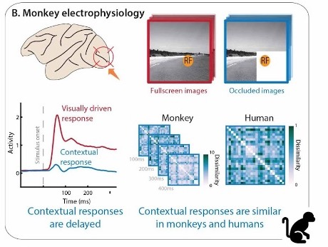
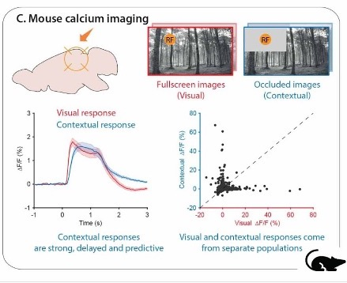
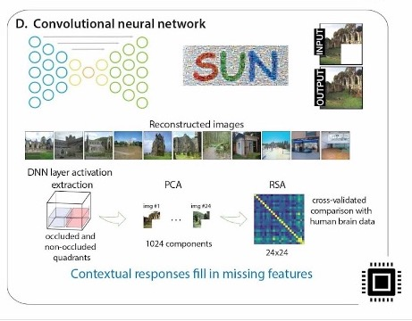

# The cortical microcircuitry of predictions and context - a multi-scale perspective

## Abstract

Conscious cognition depends on the ability of the neocortex to generate internal models of the outside world. During wakefulness, the neocortex maintains and updates knowledge of the world and uses this knowledge through top-down projections to make predictions, test hypotheses, and/or contextualise input from the senses. How are these information streams combined in cortical microcircuitry? Is their computational function to test internal models on the basis of their predictions or to contextualise sensory signals, or both? In addition to their somatic integration zones, many pyramidal neurons have a site of top-down and other contextual information integration near the top of the apical dendrite’s trunk. This enables the top-down contextualisation of bottom-up information, amplifying or attenuating sensory responses depending on prior knowledge and current context. However, current deep neural network models of sensory processing lack such a mechanism, and cognitive theories often still lack intracellular two-compartment integration. We envision how a continued synthesis of multi-scale, multi-species experimental data and theoretical and data-driven models will drive further insights into the biophysics, microcircuitry and dynamics of context-sensitive two-compartment neurons, and their role in predictive cognition.

## Authors

Lars Muckli1,2,\*,Lucy S. Petro1,2,\*, Clement Abbatecola1,2, Johanna Bergmann3, Nicolas Deperrois4, Alain Destexhe5, Nikolaus Kriegeskorte6, Christiaan N. Levelt7,8, Wolfgang Maass9, A. Tyler Morgan10, Paolo Papale11, Cyriel M. A. Pennartz12,13, Benjamin Peters1, Mihai A. Petrovici4, William. A. Phillips14, Pieter R. Roelfsema15, Robert N.S. Sachdev16, Koen Seignette7, Matthew W. Self11, Fraser W. Smith17, Johan F. Storm18, Michele Svanera1,2, Wim Vanduffel19, Walter Senn4\*, Matthew E. Larkum16,20\* 

1. Centre for Cognitive Neuroimaging, School of Psychology and Neuroscience, College of Medical, Veterinary and Life Sciences, University of Glasgow, Glasgow, United Kingdom, G12 8QB. 
2. Imaging Centre for Excellence, Queen Elizabeth University Hospital, University of Glasgow, G51 4LB. 
3. Max Planck Institute for Human Cognitive and Brain Sciences, Leipzig, Germany.  
4. Department of Physiology, University of Bern, Switzerland; Kirchhoff-Institute for Physics, Heidelberg University, Germany 
5. Paris-Saclay University, CNRS, Saclay, France 
6. Zuckerman Mind Brain Behavior Institute, Columbia University, 3227 Broadway, New York, NY, 10027, USA 
7. Netherlands Institute for Neuroscience, Molecular Visual Plasticity Group, Royal Netherlands Academy of Arts and Sciences, Meibergdreef 47, 1105 BA Amsterdam, the Netherlands. 
8. Department of Molecular and Cellular Neurobiology, Center for Neurogenomics and Cognitive Research, VU University Amsterdam, de Boelelaan 1085, 1081 HV Amsterdam, the Netherlands. 
9. Institute of Theoretical Computer Science, Graz University of Technology, Graz, Austria. 
10. Section on Functional Imaging Methods, National Institute of Mental Health, Bethesda, MD 20817, USA. 
11. Department of Vision & Cognition, Netherlands Institute for Neuroscience (KNAW), 1105 BA Amsterdam, the Netherlands. 
12. Cognitive and Systems Neuroscience Group, Swammerdam Institute for Life Sciences, University of Amsterdam, Science Park 904, 1098XH Amsterdam, The Netherlands. 
13. Amsterdam Brain and Cognition, University of Amsterdam, Science Park 904, 1098XH Amsterdam, The Netherlands. 
14. Department of Psychology, University of Stirling, Stirling, FK9 4LA, UK. 
15. Department of Vision & Cognition, Netherlands Institute for Neuroscience (KNAW), 1105 BA Amsterdam, the Netherlands; Department of Integrative Neurophysiology, VU University, De Boelelaan 1085, 1081 HV Amsterdam, the Netherlands; Department of Neurosurgery, Academic Medical Centre, Postbus 22660, 1100 DD Amsterdam, the Netherlands; Laboratory of Visual Brain Therapy, Sorbonne Université, INSERM, CNRS, Institut de la Vision, 17 rue Moreau, 75012 Paris, France. 
16. Institute of Biology, Humboldt Universität zu Berlin, Charitéplatz 1, Virchowweg 6, 10117 Berlin, Germany.  
17. School of Psychology, University of East Anglia, Norwich Research Park, Norwich NR4 7TJ, UK. 
18. Brain Signalling Group, Department of Physiology, Institute of Basic Medicine, University of Oslo, Oslo, Norway. 
19. Laboratory for Neuro- and Psychophysiology, Department of Neurosciences, KU Leuven Medical School, Leuven, 3000, Belgium. Leuven Brain Institute, KU Leuven, Leuven, 3000, Belgium. Athinoula A. Martinos Center for Biomedical Imaging, Massachusetts General Hospital, Charlestown, MA, 02129, USA. Department of Radiology, Harvard Medical School, Boston, MA, 02144, USA. 
20. Neurocure Center for Excellence, Charité Universitätsmedizin Berlin & Humboldt Universität, Berlin, Germany 
*Equal contribution 

